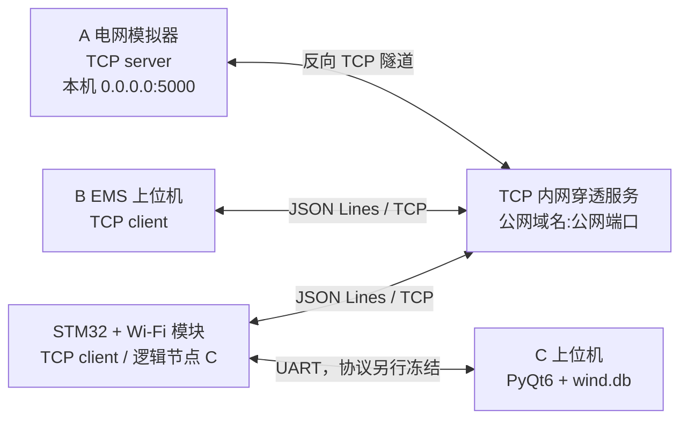
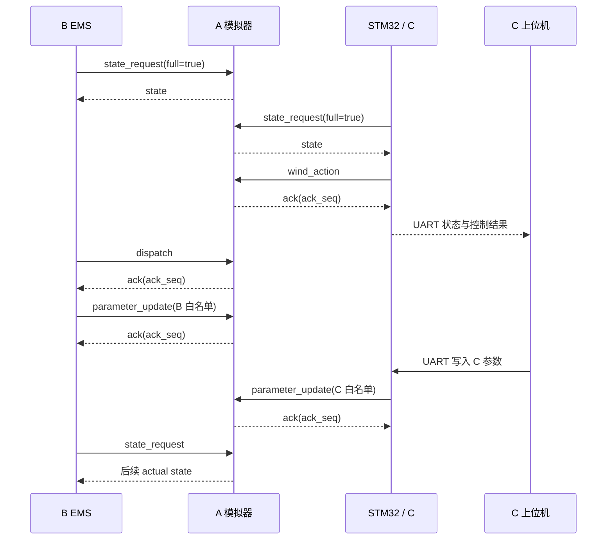

# A/B/C 通信方案草案

状态：`draft-0.4`，尚未冻结。依据课程原文、`common/protocol.md`、A 当前 TCP 服务端和 B 当前 `tcpB.py` 实现编写。

## 1. 正式拓扑



- A 是唯一 TCP 服务端；B 与 STM32/Wi-Fi 模块主动连接 A。
- A 电脑运行支持原始 TCP 转发的内网穿透客户端，把公网端点映射到 A 本机 `127.0.0.1:5000`。
- B 和 STM32 配置公网域名/IP与公网端口，不把地址硬编码到仓库。
- C 上位机只通过 UART 与 STM32 交换状态、参数和模式，维护 `wind.db`，不代替 STM32 控制算法。
- 同一局域网调试时可绕过公网隧道，B/STM32 直接连接 A 的 WLAN IPv4；应用层协议不变。

此拓扑满足课程原文中“STM32 通过 Wi-Fi 作为 A 的 TCP 客户端”的职责划分。Radmin 地址 `26.157.25.160` 不再作为正式通信端点。

## 2. 穿透服务要求

所选工具必须满足：

- 支持原始 TCP 端口转发，而不只是 HTTP/HTTPS。
- 只要求 A 电脑运行穿透客户端；B 和 STM32 能用普通 TCP socket 直接连接公网端点。
- 提供可供 STM32 使用的固定域名或固定公网 IP及端口。
- 若公网地址使用域名，STM32 的 Wi-Fi 模块必须支持 DNS。
- 若隧道强制 TLS，Wi-Fi 模块必须具备相应 TLS 能力；基础联调优先使用透明 TCP 转发。
- 能承载长连接，且不会修改 JSON 字节流或 LF 帧边界。

示意映射：

```text
<public_host>:<public_port>  ->  A:127.0.0.1:5000
```

A 仍监听：

```powershell
.\scripts\run_a.ps1 serve --bind 0.0.0.0 --port 5000
```

公网服务商、域名、端口、访问令牌和账号信息只能放在各自本地配置中，不提交 Git。

2026-09-08 联调示例可将公网 `frp-box.com:38243` 映射到 A 本机 `127.0.0.1:5005`。A UI 中的 bind/port 是本地 TCP 子进程监听设置，不会配置 FRP；B/STM32 客户端应把 host 与 port 分开填写为 `frp-box.com` 和 `38243`。该端点不是协议常量，变化后只更新各机本地配置。

## 3. 节点职责

| 节点 | TCP 身份 | 接收 | 发送 | 禁止事项 |
|---|---|---|---|---|
| A | server，`source=A` | `state_request`、`dispatch`、`wind_action`、`parameter_update` | `state`、`ack` | 不把 target 冒充 actual，不越权改写 B/C 参数 |
| B | client，`source=B` | A 的 `state/ack` | `state_request/dispatch/parameter_update` | 不发送桨距，不写 actual，只同步 B 所有权参数 |
| STM32 | client，`source=C` | A 的 `state/ack` | `state_request/wind_action/parameter_update` | 不控制柴油机，不修改负荷，只同步 C 所有权参数 |
| C 上位机 | UART host，无 A-facing TCP 身份 | STM32 状态/结果 | 参数、模式、查询请求 | 不替代 STM32 保护与控制 |

TCP 中的 `C` 始终指 STM32 风机控制逻辑节点。C 上位机与 STM32 的 UART 消息号是独立序列，不使用 TCP 的 `seq`。

## 4. TCP 帧格式

- UTF-8 编码。
- 一个 JSON 对象一行，以单个 LF 字节 `\n` 结束。
- 单帧最大 4096 bytes，包含 LF。
- 接收端缓存到 LF 后解析；一次 `recv()` 可能得到半帧、完整帧或多个帧。
- 拒绝空帧、超长帧、非法 UTF-8/JSON、NaN/Infinity 和字段类型错误。

公共 envelope：

```json
{
  "version": 1,
  "type": "state_request",
  "source": "B",
  "target": "A",
  "session_id": null,
  "seq": 0,
  "step": 0,
  "sim_time_s": 0.0,
  "payload": {}
}
```

| 字段 | 规则 |
|---|---|
| `version` | 当前固定为整数 `1` |
| `type` | `state_request/state/dispatch/wind_action/parameter_update/ack` |
| `source/target` | `A/B/C`；C 指 STM32 |
| `session_id` | A 创建的仿真会话 ID；首次请求可为 `null` |
| `seq` | 发送方递增非负整数；允许跳号，不允许同会话倒退 |
| `step` | 报文引用的 A 状态步号 |
| `sim_time_s` | 报文引用的 A 仿真时间，单位 s |
| `payload` | 由消息类型确定的 JSON 对象 |

## 5. 消息定义

### 5.1 `state_request`：B/STM32 -> A

首次连接、重连或会话变化后必须请求全量状态：

```json
{"version":1,"type":"state_request","source":"B","target":"A","session_id":null,"seq":0,"step":0,"sim_time_s":0.0,"payload":{"full":true}}
```

STM32 将 `source` 改为 `C`。当前 A 对 `full=true/false` 都返回完整状态；保留 `full` 字段供后续变位发送扩展。

### 5.2 `state`：A -> B/STM32

`state.payload` 包含公共能力字段 `wind_available_kw` 和 `wind_operating_limit_kw`。二者由 C 计算，经 A 校验、存储和转发，A/B/C 均需适配：

```json
{
  "version": 1,
  "type": "state",
  "source": "A",
  "target": "B",
  "session_id": "a-session-id",
  "seq": 1,
  "step": 5,
  "sim_time_s": 5.0,
  "payload": {
    "sampled_at_utc": "2026-09-07T08:03:25.417Z",
    "wind_speed_mps": 8.2,
    "wind_available_kw": 68.0,
    "wind_operating_limit_kw": 64.0,
    "load_power_kw": 76.0,
    "wind_actual_kw": 42.0,
    "diesel_actual_kw": 34.0,
    "wind_target_kw": 45.0,
    "pitch_actual_deg": 0.0,
    "wind_running": true,
    "fault": false
  }
}
```

A 根据请求来源把 `target` 设置为 `B` 或 `C`。

能力字段分两层：

- `wind_available_kw`：C 按 A 的当前风速、C 保存的风机参数和统一三次功率曲线计算，受 100 kW 额定功率限制，不考虑目标、启停、桨距或爬坡。
- `wind_operating_limit_kw`：C 在资源可用功率基础上考虑运行许可、保护/故障和设备上限，满足 `0 <= wind_operating_limit_kw <= wind_available_kw`；不考虑 B 目标、桨距目标或实际爬坡。

B 使用 `wind_operating_limit_kw` 约束 `wind_target_kw`。A 再根据目标、双方启停条件、C 桨距、物理上限和爬坡约束计算 `wind_actual_kw`。三个状态功率字段不得互相替代。

### 5.3 `dispatch`：B -> A

```json
{
  "version": 1,
  "type": "dispatch",
  "source": "B",
  "target": "A",
  "session_id": "a-session-id",
  "seq": 6,
  "step": 5,
  "sim_time_s": 5.0,
  "payload": {
    "wind_target_kw": 45.0,
    "diesel_target_kw": 31.0,
    "wind_enable": true,
    "diesel_enable": true
  }
}
```

B 的 payload 只能包含这 4 个字段，不能发送 `pitch_target_deg` 或任何 actual 字段。

### 5.4 `wind_action`：STM32 -> A

```json
{
  "version": 1,
  "type": "wind_action",
  "source": "C",
  "target": "A",
  "session_id": "a-session-id",
  "seq": 9,
  "step": 5,
  "sim_time_s": 5.0,
  "payload": {
    "wind_enable": true,
    "pitch_target_deg": 3.5,
    "wind_available_kw": 68.0,
    "wind_operating_limit_kw": 68.0
  }
}
```

STM32 负责计算 payload 中的两个能力字段和桨距/启停动作；不发送柴油机目标、负荷修改或 actual 字段。

### 5.5 `parameter_update`：B/STM32 -> A

参数同步只更新 A 保存和展示的参数副本，不转移计算职责。payload 必须精确为一个非空 `parameters` 对象；每个值是有限非负数字：

```json
{
  "version": 1,
  "type": "parameter_update",
  "source": "B",
  "target": "A",
  "session_id": "a-session-id",
  "seq": 7,
  "step": 5,
  "sim_time_s": 5.0,
  "payload": {
    "parameters": {
      "reserve_kw": 10.0,
      "b_poll_s": 1.0,
      "b_dispatch_s": 5.0
    }
  }
}
```

- B 白名单：`reserve_kw`、`b_poll_s`、`b_dispatch_s`。
- C 白名单：`wind_rated_power_kw`、`cut_in_speed_mps`、`rated_speed_mps`、`cut_out_speed_mps`、`pitch_full_output_deg`、`pitch_feather_deg`、`c_control_s`、`c_timeout_s`。
- C 上位机先通过 UART 将 C 参数写入 STM32；联网时由逻辑节点 C/STM32 使用 `source=C` 同步给 A。C 上位机不直接获得 A-facing TCP 身份。
- A 自有仿真/设备动态参数只经 A 本地界面修改，不通过 B/C 报文写入。
- A 对整条参数关系执行原子校验；任一名称、数值、所有权或关系非法时都不部分落库。
- C 风机物理参数更新会使 A 缓存的旧 C action 立即失效；C 必须根据新参数再发 `wind_action`，A 不代算。

### 5.6 `ack`：A -> B/STM32

```json
{
  "version": 1,
  "type": "ack",
  "source": "A",
  "target": "B",
  "session_id": "a-session-id",
  "seq": 7,
  "step": 5,
  "sim_time_s": 5.0,
  "payload": {
    "ack_seq": 6,
    "accepted": true,
    "reason": "accepted"
  }
}
```

- `ack_seq` 指向被确认的 `dispatch/wind_action/parameter_update.seq`。
- `accepted=true` 只表示 A 接收并通过校验，不表示设备已经达到目标。
- 实际结果看后续 `state.*_actual_kw` 和 `pitch_actual_deg`。
- 客户端用 `seq -> 本地命令记录` 的 pending 映射更新命令状态。
- 参数 ACK 只表示 A 已更新副本；B 调度或 C/STM32 是否采用新参数，应查看对应模块状态与后续业务报文。

## 6. 正常通信时序



- A 默认每 1 s 推进一个仿真步。
- B 默认每 1 s 请求状态、每 5 s 计算并发送调度。
- STM32 状态请求与控制周期统一为 1 s；UART 帧细节仍待冻结。
- 每条连接同一时刻最多保留一个未完成的应用层请求：`state_request -> state` 或 `command -> ack`。
- B 的 socket 由网络工作线程独占，PyQt6 主线程不执行阻塞 `connect/recv/sendall`。
- STM32 使用接收缓存按 LF 分帧，不在 UART/TCP 中断中执行长时间处理。

## 7. 会话、序号与重复处理

- A 的 `session_id` 变化表示新仿真会话。客户端丢弃旧状态和旧会话 pending 命令，重新发送 `full=true`。
- 接收 `state` 时先识别 `session_id`；新会话重置接收序号基线后再检查 `seq`。
- A 按 `session_id + source + seq` 对 dispatch、wind_action 和 parameter_update 去重。
- 完全相同 type 与规范化 payload 的命令重发不得再次执行；A 返回 `duplicate_accepted` ACK。
- 同一序号携带不同 type 或 payload 时拒绝为 `seq_conflict`；同会话中未出现过但小于已处理最大序号的命令拒绝为 `out_of_order`。
- A 当前在 B/C 响应之间使用全局服务端序号，单个客户端看到跳号是正常现象。

## 8. 断线、超时与重连

```text
DISCONNECTED -> CONNECTING -> SYNCING -> ONLINE
      ^              |           |          |
      +--------------+-----------+----------+
                 timeout / EOF / protocol error
```

1. timeout、EOF 或不可恢复帧错误后关闭旧 socket、清空分帧缓存并标记离线。
2. 使用有上限的退避重新连接公网端点。
3. 重连后先发送 `state_request(full=true)`；未收到合法全量状态前不进入闭环。
4. 命令已发送但 ACK 未到时，结果属于未知。A 会话未变化时，可重发完全相同的报文和 `seq`，利用 A 去重；不得更换新序号盲目重发。
5. 域名解析失败或公网隧道故障按 TCP 断线处理，不把旧状态标为新状态。
6. STM32 TCP 断线与 C 上位机 UART 断线分别记录；不得用 PC mock 动作替代真实 STM32。

## 9. 时间接口

- `sim_time_s`：A 的仿真时间轴。
- `sampled_at_utc`：A 生成状态断面的 UTC RFC 3339 时间，由 B/C 原样保存。
- `received_at_utc`：B 或 STM32/C 上位机的本地接收时间，不回写为 A 的采样时间。
- 状态新鲜度使用接收端单调时钟计算，不使用设备墙钟差排序。
- 控制顺序只依赖 `session_id + step + seq`。

## 10. 公网安全边界

当前 v1 协议本身没有身份认证或加密，不能把一个无限制的 A 控制端口长期暴露到公网。正式公网运行前至少落实一种受控方案：

- 穿透服务端提供访问控制或来源白名单；或
- STM32/Wi-Fi 模块支持 TLS，并验证服务端；或
- 经三方确认后为应用协议增加认证字段/HMAC 和防重放规则。

令牌、密码、Wi-Fi 信息和真实服务端配置不得提交仓库，也不得打印到普通日志。随机高端口不能替代认证。

## 11. 当前实现状态

- A 已支持 JSON Lines、4096 bytes、半帧/粘包、`state_request/state`、`dispatch/wind_action/parameter_update/ack`、命令去重和连接重建。
- B 已实现单未决状态请求、持续消费到新 `state`、发送 dispatch 后等待匹配 ACK，避免响应积压。
- B 尚需把 ACK 最终结果完整回写命令记录，并用单调时钟维护状态新鲜度。
- B/C 尚需实现各自 `parameter_update` 的发送入口并完成跨机联调；A UI 已按 owner/source 展示本地参数和收到的只读副本。
- STM32 Wi-Fi TCP 客户端和 C UART 协议尚未完成，硬件结果必须明确标注实机或 mock。
- A/B 软件已适配 `wind_available_kw` 和 `wind_operating_limit_kw`；STM32 Wi-Fi 客户端仍待实现，在真实三方联调前不得宣称字段闭环完成。
- A 对命令允许滞后的最大 step/秒数尚未冻结。

## 12. 联调步骤

1. 本机先用 `127.0.0.1:5000` 验证 A/B JSON Lines 和 ACK。
2. 局域网使用 A 的 WLAN IPv4 验证 B 到 A，再验证 STM32 到 A。
3. 配置 raw TCP 隧道，将公网端点映射到 A `127.0.0.1:5000`。
4. 在外部网络执行 `Test-NetConnection <public_host> -Port <public_port>`，随后验证 B 全量同步、dispatch ACK 和 B 参数白名单同步。
5. STM32 连接相同公网端点，验证全量状态、`wind_action`、C 参数同步、ACK、拆包/粘包和重连。
6. 接入 C 上位机 UART，验证参数/模式下发、状态回传、数据库与界面。
7. 分别中断 B TCP、STM32 TCP、A 隧道和 C UART，检查离线标记、日志、退避重连及全量同步。
8. 按 `docs/acceptance.md` 记录实机结果、异常及复现步骤。

## 13. 待确认项

- 内网穿透服务是否支持固定 raw TCP、公网长连接、访问控制以及 STM32 可用的 DNS/TLS能力。
- STM32/Wi-Fi 模块型号、AT 固件和最大可用帧缓存。
- STM32 状态请求、控制运算与动作上送的 1 s 周期实机验证。
- C UART 帧头、长度、消息号、校验、编码、字节序和最大帧长。
- A/B/STM32 对 `wind_available_kw`、`wind_operating_limit_kw` 的实机字段一致性测试。
- 命令允许引用当前状态之前的最大步数/秒数。
- TCP/UART 失联时 A、B、STM32/C 上位机的安全动作和恢复条件。
- B 调度启停与 C 保护动作冲突时的最终优先级。
